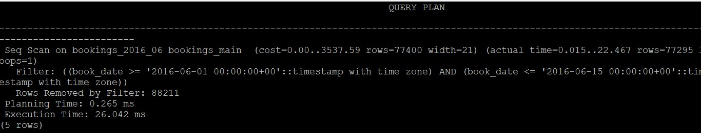
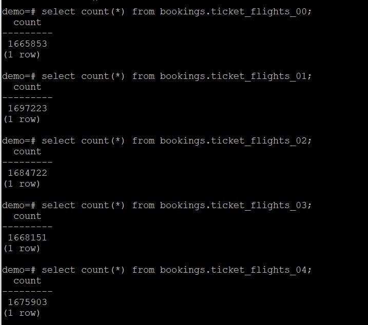

| **<br/>Лабораторная работа №10 по курсу "PostgreSQL для администраторов баз данных и разработчиков"<br/>"Секционирование таблицы"<br/>**|
|---|

<br/>

## Задание:
### * научиться выполнять секционирование таблиц в PostgreSQL;
### * повысить производительность запросов и упростив управление данными;


<br/>

## Решение:

* Создал виртуальную машину, установил Ubuntu 22.04, PostgreSQL v.16
* Создал новый кластер PostgreSQL main (sudo pg_createcluster 16 main)
* Скачал демо базу 
```
wget https://edu.postgrespro.ru/demo-big-20161013.zip
```
* Развернул копию БД под пользователем postgres
```
psql -f demo_big.sql
```
* Логическую привязку к диапазонам, по которым можно провести секционирование, имею таблицы bookings (поле book_date), flights (поле scheduled_departure) и ticket_flights (поле flight_id, если секционировать по хэшу рейсов)
* Для секционирования выбрал таблицы:
 * bookings - достаточно большая таблица, секционирование по полю book_date обеспечит более быстрый доступ к данным нужных периодов, т.к. поиск информации в большинстве случаев будет идти с использованием даты (ключа секционирования)
 * ticket_flights - достаточно большая таблица, секционирование по полю flight_id (с использованием хэша значений) обеспечит более быстрый доступ к данным нужных периодов, т.к. поиск информации в большинстве случаев будет идти с использованием номера рейса (ключа секционирования)
* Создал главную таблицу
```
CREATE TABLE bookings.bookings_main
(
    book_ref character(6) NOT NULL,
    book_date timestamp with time zone NOT NULL,
    total_amount numeric(10,2) NOT NULL,
    
    PRIMARY KEY (book_ref, book_date)
) PARTITION BY RANGE (book_date);
```
* Определил периоды в таблице bookings
```
select min(book_date), max(book_date) from bookings.bookings;
```


* Создал секции для bookings_main 
```
CREATE TABLE bookings.bookings_2015_09 PARTITION OF bookings.bookings_main FOR VALUES FROM ('2015-09-01') TO ('2015-10-01');
CREATE TABLE bookings.bookings_2015_10 PARTITION OF bookings.bookings_main FOR VALUES FROM ('2015-10-01') TO ('2015-11-01');
CREATE TABLE bookings.bookings_2015_11 PARTITION OF bookings.bookings_main FOR VALUES FROM ('2015-11-01') TO ('2015-12-01');
CREATE TABLE bookings.bookings_2015_12 PARTITION OF bookings.bookings_main FOR VALUES FROM ('2015-12-01') TO ('2016-01-01');
CREATE TABLE bookings.bookings_2016_01 PARTITION OF bookings.bookings_main FOR VALUES FROM ('2016-01-01') TO ('2016-02-01');
CREATE TABLE bookings.bookings_2016_02 PARTITION OF bookings.bookings_main FOR VALUES FROM ('2016-02-01') TO ('2016-03-01');
CREATE TABLE bookings.bookings_2016_03 PARTITION OF bookings.bookings_main FOR VALUES FROM ('2016-03-01') TO ('2016-04-01');
CREATE TABLE bookings.bookings_2016_04 PARTITION OF bookings.bookings_main FOR VALUES FROM ('2016-04-01') TO ('2016-05-01');
CREATE TABLE bookings.bookings_2016_05 PARTITION OF bookings.bookings_main FOR VALUES FROM ('2016-05-01') TO ('2016-06-01');
CREATE TABLE bookings.bookings_2016_06 PARTITION OF bookings.bookings_main FOR VALUES FROM ('2016-06-01') TO ('2016-07-01');
CREATE TABLE bookings.bookings_2016_07 PARTITION OF bookings.bookings_main FOR VALUES FROM ('2016-07-01') TO ('2016-08-01');
CREATE TABLE bookings.bookings_2016_08 PARTITION OF bookings.bookings_main FOR VALUES FROM ('2016-08-01') TO ('2016-09-01');
CREATE TABLE bookings.bookings_2016_09 PARTITION OF bookings.bookings_main FOR VALUES FROM ('2016-09-01') TO ('2016-10-01');
CREATE TABLE bookings.bookings_2016_10 PARTITION OF bookings.bookings_main FOR VALUES FROM ('2016-10-01') TO ('2016-11-01');
```
* Перенес данные из таблицы bookings в таблицу bookings_main, проверил распределение


* Выполнил запрос для поиска рейсов в период с 01.06.2016 по 15.06.2016, рейсы были найдены за 26мс
```
explain analyze select * from bookings.bookings_main where book_date between '2016-06-01' and '2016-06-15';
```



* Повторил запрос на таблице без секций, результат 145 мс


* Добавил индекс на таблицу bookings, повторил запрос. Запрос выполнился за 89мс. 
```
create index ON bookings.bookings (book_date);
```


* Т.е. в данном случае видим что полное сканирование таблицы при секционировании выигрывает у индексного сканирования сходной таблицы
* Добавил индекс на секционированную таблицу и повторил запрос. Запрос выполнился за 18мс


* Увеличил диапазон поиска
```
explain analyze select * from bookings.bookings where book_date between '2016-05-01' and '2016-06-15';
```

* Для секционированной таблицы результат 55мс


* Для исходной таблицы результат 101мс


* Отсюда делаю вывод что при увеличении секций так же получаем прирос производительности, если только не задействуем все секции таблицы

* Повторяю для таблицы ticket_flights
* Построил основную таблицу
```
CREATE TABLE bookings.ticket_flights_main
(
    ticket_no character(13) NOT NULL,
    flight_id integer NOT NULL,
    fare_conditions character varying(10) NOT NULL,
    amount numeric(10,2) NOT NULL,
    
    PRIMARY KEY (ticket_no, flight_id)
) PARTITION BY HASH (flight_id);
```
* Добавил секции
```
CREATE TABLE bookings.ticket_flights_00 PARTITION OF bookings.ticket_flights_main FOR VALUES WITH (MODULUS 5, REMAINDER 0);
CREATE TABLE bookings.ticket_flights_01 PARTITION OF bookings.ticket_flights_main FOR VALUES WITH (MODULUS 5, REMAINDER 1);
CREATE TABLE bookings.ticket_flights_02 PARTITION OF bookings.ticket_flights_main FOR VALUES WITH (MODULUS 5, REMAINDER 2);
CREATE TABLE bookings.ticket_flights_03 PARTITION OF bookings.ticket_flights_main FOR VALUES WITH (MODULUS 5, REMAINDER 3);
CREATE TABLE bookings.ticket_flights_04 PARTITION OF bookings.ticket_flights_main FOR VALUES WITH (MODULUS 5, REMAINDER 4);
```
* Проверил распределение между секциями, получилось примерно равномерно



* Подготовил запрос
```
explain analyze select * from bookings.ticket_flights_main where flight_id = 25144;
```
* Выполнил его на секционированной таблице, получил результат 108мс


* Выполнил его на основной таблице, получил результат 393мс


* Отсюда делаем вывод что секционирование по хэшу работает так же эффективно, получили прирост производительности в 3,5 раза.
